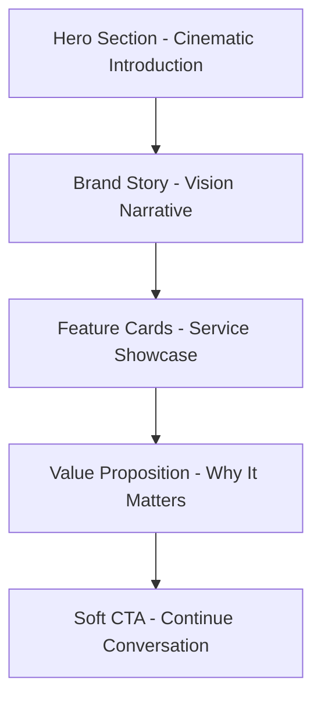

## 1. Product Overview

A premium, cinematic landing page that reimagines Unilodge Realty as a next-generation, tech-driven property brand. This single-page concept serves as a sales pitch to convince the client to approve a full website rebuild by showcasing the potential of modern digital experiences in real estate.

The landing page delivers immersive storytelling through luxurious design, smooth animations, and strategic content positioning to demonstrate how a premium digital presence can elevate the brand's market position and build trust with modern audiences.

## 2. Core Features

### 2.1 User Roles

This is a public-facing marketing landing page with no user authentication required. All visitors have the same viewing permissions.

### 2.2 Feature Module

The landing page consists of the following main sections:

1. **Hero Section**: Full-screen cinematic introduction with background video/image, headline, and primary CTA
2. **Brand Story Section**: Vision narrative with animated text reveals about community, innovation, and sustainability
3. **What They Do Section**: Feature cards showcasing Property Development, Real Estate Investment, Sustainable Communities, and Technology-Driven Management
4. **Why This Matters Section**: Strategic positioning content explaining the value of modern digital presence
5. **Soft Call to Action Section**: Closing pitch with secondary CTA to continue the conversation

### 2.3 Page Details

| Page Name    | Module Name               | Feature description                                                                                                                                                                                                                                          |
| ------------ | ------------------------- | ------------------------------------------------------------------------------------------------------------------------------------------------------------------------------------------------------------------------------------------------------------ |
| Landing Page | Hero Section              | Display full-screen cinematic background with luxury real estate imagery, animated headline "Redefining Real Estate for a New Generation", supporting text about community/technology/trust, and "Explore the Vision" CTA button with smooth scroll behavior |
| Landing Page | Brand Story Section       | Present animated text content explaining community-focused real estate approach, innovation commitment, and sustainability values with scroll-triggered fade and slide animations                                                                            |
| Landing Page | Feature Cards Section     | Display 3-5 animated feature cards for Property Development, Real Estate Investment, Sustainable Communities, and Technology-Driven Management with GSAP-powered entrance animations                                                                         |
| Landing Page | Value Proposition Section | Explain why modern digital presence matters with content positioning the redesign as future-ready, trust-building, and premium with animated text reveals                                                                                                    |
| Landing Page | Soft CTA Section          | Present closing copy "This is just the beginning" and "If this direction feels right, we can continue building" with "Let's Continue" button for client follow-up                                                                                            |

## 3. Core Process

The user journey flows through a single-page scroll experience designed to build excitement and convince the client of the redesign's value. Visitors land on the cinematic hero section, scroll through brand storytelling, discover service offerings via feature cards, understand the strategic importance of digital transformation, and conclude with a soft call-to-action that invites further discussion about the full website rebuild.

## 4. User Interface Design

### 4.1 Design Style

* 🔴 Primary Colors&#x20;

  * **Primary Red**:\
    `#C1121F`\
    Deep, controlled red. Authority without screaming.
  * **Charcoal Black**:\
    `#121212`\
    Used for text, dark sections, and contrast. Grounds the red.
  * **Pure White**:\
    `#FFFFFF`\
    Clean canvas. Makes everything breathe.

  ***

  ### ⚪ Secondary Colors

  * **Soft Off-White**:\
    `#F5F5F5`\
    For section breaks and light backgrounds.
  * **Muted Gray**:\
    `#8A8A8A`\
    For secondary text, captions, meta info.
  * **Dark Gray**:\
    `#2A2A2A`\
    For cards, overlays, and subtle depth.

* **Button Style**: Minimal, rounded corners with subtle hover animations and premium feel

* **Typography**: Large, bold headlines (clamp 3rem-6rem) with strong hierarchy, clean sans-serif fonts

* **Layout Style**: Full-screen sections with generous whitespace, card-based feature presentation

* 🖼️ Visual Content Priority (IMPORTANT)&#x20;

  * **High-quality imagery is preferred over icons.**
  * Images should be used to:
    * communicate lifestyle, scale, and trust
    * create emotional connection
    * elevate perceived value
  * Use:
    * full-bleed hero images or videos
    * large section imagery
    * subtle parallax or motion effects with GSAP
  * Avoid excessive icon grids.
  * Icons are allowed **only** when:
    * reinforcing text
    * used sparingly in metadata or supporting UI
  * When choosing between an icon and an image, **always choose an image**.

### 4.2 Page Design Overview

| Page Name    | Module Name               | UI Elements                                                                                                                                                                                                          |
| ------------ | ------------------------- | -------------------------------------------------------------------------------------------------------------------------------------------------------------------------------------------------------------------- |
| Landing Page | Hero Section              | Full-screen height with cinematic background video/image, slow zoom/parallax motion, large animated headline with fade+slide reveal, supporting text with staggered animation, premium CTA button with hover effects |
| Landing Page | Brand Story Section       | Split dark/light contrast layout, animated text blocks with scroll-triggered reveals, generous whitespace, elegant typography hierarchy, smooth section transitions                                                  |
| Landing Page | Feature Cards Section     | Grid layout with 3-5 premium cards, subtle shadow effects, animated entrance with GSAP, hover interactions, consistent spacing and alignment                                                                         |
| Landing Page | Value Proposition Section | Alternating dark/light background sections, animated content blocks, strategic use of whitespace, compelling typography with animation timing                                                                        |
| Landing Page | Soft CTA Section          | Clean minimal design, prominent but not aggressive CTA placement, concluding text with fade-in animation, professional button styling                                                                                |

### 4.3 Responsiveness

Desktop-first design approach with mobile-adaptive layouts. Touch interaction optimization for mobile devices while maintaining cinematic impact on larger screens. Responsive typography and spacing that scales appropriately across breakpoints.

### 4.4 Animation Guidelines

* **GSAP ScrollTrigger**: Smooth scroll-triggered animations throughout all sections

* **Text Animations**: Fade + slide reveals with careful timing and easing

* **Parallax Movement**: Subtle background movement creating depth and immersion

* **Section Transitions**: Seamless animated transitions between content blocks

* **Performance**: Optimized animations with will-change properties and efficient rendering

