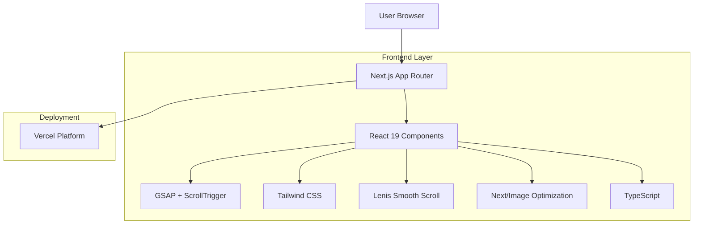

## 1. Architecture Design



## 2. Technology Description

- **Frontend**: Next.js 15 (App Router) + React 19 + TypeScript
- **Styling**: Tailwind CSS v3 with custom configuration
- **Animations**: GSAP v3 + ScrollTrigger plugin + Lenis smooth scroll
- **Performance**: Next/Image for optimized image loading
- **Typography**: next/font for optimized font loading
- **Initialization Tool**: create-next-app
- **Backend**: None (static landing page)
- **Deployment**: Vercel

## 3. Route Definitions

| Route | Purpose |
|-------|---------|
| / | Landing page - Single page application with all sections |

## 4. Component Architecture

### 4.1 Core Components
- **HeroSection**: Full-screen cinematic hero with background video/image and animated headline
- **BrandStorySection**: Vision narrative with scroll-triggered text animations
- **FeatureCardsSection**: Animated feature cards showcasing services
- **ValuePropositionSection**: Strategic content with animated reveals
- **SoftCTASection**: Closing call-to-action with smooth animations
- **Navigation**: Smooth scroll navigation with active section highlighting

### 4.2 Animation Configuration
```typescript
// GSAP ScrollTrigger configuration
interface ScrollAnimationConfig {
  trigger: string;
  start: string;
  end?: string;
  scrub?: number | boolean;
  pin?: boolean;
  anticipatePin?: number;
}

// Text reveal animation interface
interface TextRevealAnimation {
  opacity: number;
  y: number;
  duration: number;
  ease: string;
  stagger?: number;
}
```

## 5. Performance Optimization

### 5.1 Image Optimization
- Next/Image component for automatic optimization
- WebP format with fallbacks
- Responsive image sizing
- Lazy loading for below-fold content

### 5.2 Animation Performance
- Hardware-accelerated transforms
- will-change CSS properties
- Efficient GSAP timeline management
- RAF-optimized scroll handlers

### 5.3 Bundle Optimization
- Tree shaking for unused code
- Dynamic imports for non-critical components
- Optimized Tailwind CSS purging
- Font subsetting and preloading

## 6. Development Guidelines

### 6.1 Code Structure
```
src/
├── app/
│   ├── layout.tsx          # Root layout with fonts and metadata
│   ├── page.tsx            # Main landing page
│   └── globals.css         # Global styles and Tailwind
├── components/
│   ├── sections/
│   │   ├── HeroSection.tsx
│   │   ├── BrandStorySection.tsx
│   │   ├── FeatureCardsSection.tsx
│   │   ├── ValuePropositionSection.tsx
│   │   └── SoftCTASection.tsx
│   └── ui/
│       ├── Button.tsx
│       └── Card.tsx
├── hooks/
│   ├── useScrollAnimation.ts
│   └── useParallax.ts
├── lib/
│   ├── gsap.ts            # GSAP configuration
│   └── animations.ts      # Reusable animation presets
└── types/
    └── animations.ts
```

### 6.2 Animation Patterns
- Use GSAP timelines for complex sequences
- Implement proper cleanup in useEffect hooks
- Respect user motion preferences (prefers-reduced-motion)
- Optimize for mobile performance

### 6.3 Responsive Design
- Mobile-first approach with desktop enhancements
- Touch-friendly interactions
- Performance-conscious animations on mobile
- Adaptive typography scaling

## 7. Deployment Configuration

### 7.1 Vercel Settings
- Automatic deployments from main branch
- Environment variable configuration
- Performance analytics enabled
- Real-time collaboration features

### 7.2 Build Optimization
- Static generation for fastest performance
- Automatic image optimization
- Edge network distribution
- Built-in performance monitoring